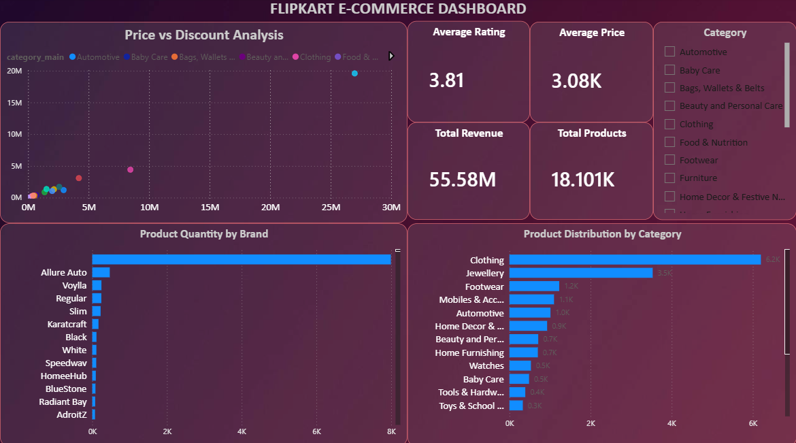

# flipkart-data-analytics-project
Power BI dashboard analyzing Flipkart E-commerce data
## Flipkart E-Commerce Dashboard

## Overview

This project analyzes Flipkart product data using Power BI to generate business insights.

## Tools Used

* Power BI
* Power Query
* DAX

## Features

* KPI Cards (Revenue, Products, Rating, Price)
* Category-wise product distribution
* Top brands analysis
* Price vs Discount scatter analysis
* Interactive filters

## Dashboard Preview

## Insights

* Clothing is the top category
* Significant variation in pricing and discounts
* A few brands dominate the listings
